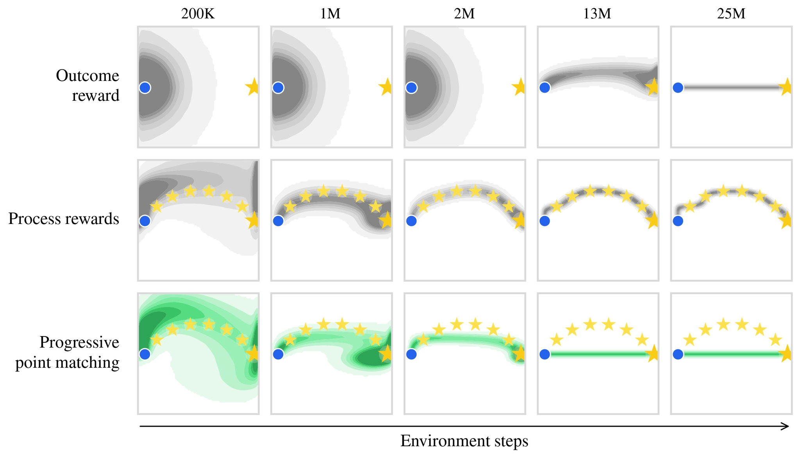

# Progressive Point Matching

###  <a href="https://prestonfu.com/notes/ppm/">[Blog]</a> &nbsp; <a href="https://prestonfu.com/assets/pdf/ppm.pdf">[Paper]</a>

Progressive Point Matching is a simple and unbiased dense reward formulation for LLM RL, which can scale exponentially more efficiently to long-horizon tasks and perform well on challenging math reasoning domains.

We provide a JAX implementation, along with standard LLM post-training methods such as GRPO and SFT. Our code can run on both TPUs and GPUs. It's based on [kvfrans/lmpo](https://github.com/kvfrans/lmpo) and supports multi-host training with DP/FSDP/TP and multi-turn environments.

<p align="center">
  
</p>

## Install

```bash
uv sync
source .venv/bin/activate
```

Depending on your hardware, additionally run one of:

```bash
uv sync --extra tpu
uv sync --extra gpu
```

For Huggingface and Gemini metrics, create `.env`:

```bash
HF_TOKEN=...
GEMINI_API_KEY=...
```

## Prepare Models

Convert Huggingface checkpoints, this can run on CPU.

```bash
python -m lmpo.models.prepare_model \
  --model_id Qwen/Qwen3-1.7B \
  --model_dir /path/to/shared/models/Qwen3-1.7B/
```

Here, `model_dir` is a filesystem path visible on each host. We use Google Cloud Storage and mount it on each host via `gcsfuse`.

As a sanity check, verify that sampling works on the prepared model:

```bash
python scripts/launch_tpc.py \
  --config scripts/experiments/sample_poem.py \
  --name <tpu-name> \
  --project <tpu-project> \
  --zone <tpu-zone> \
  --tmux-session lmpo-sample \
  --setup "source /path/to/shared/ppm/.venv/bin/activate" \
  --rsync-to /path/to/shared/ppm/ \
  --override model_dir=/path/to/shared/models/Qwen3-1.7B/
```

## Training

Our main experiment configs are in `scripts/experiments/`.

Launch on TPUs:

```bash
python scripts/launch_tpc.py \
  --config scripts/experiments/train_countdown4.py \
  --name <tpu-name> \
  --project <tpu-project> \
  --zone <tpu-zone> \
  --tmux-session lmpo-countdown \
  --setup "source /path/to/shared/ppm/.venv/bin/activate" \
  --rsync-to /path/to/shared/ppm/ \
  --override model_dir=/path/to/shared/models/Qwen3-1.7B/ \
  --override wandb_name=countdown4-2048 \
  --override env.tokens_per_action=2048
```

Launch on a GPU host (currently we support single node training):

```bash
python scripts/launch_gpu.py \
  --config scripts/experiments/train_countdown4.py \
  --host <ssh-host> \
  --tmux-session lmpo-countdown \
  --setup "source /path/to/shared/ppm/.venv/bin/activate" \
  --rsync-to /path/to/shared/ppm/ \
  --override model_dir=/path/to/shared/models/Qwen3-1.7B/ \
  --override wandb_name=countdown4-2048 \
  --override env.tokens_per_action=2048
```

Both launchers stage your local repo with `rsync` without deleting extra remote files. Add `--rsync-exclude PATTERN` for extra excludes.

## Layout

- `core/`: GRPO, SFT, sampling, evaluation, and reward metrics (such as progressive point matching).
- `envs/`: training/evaluation environments.
- `models/`: we support Qwen3 models.
- `scripts/experiments/`: run configs.
- `scripts/data/`: reproduce dataset construction.
- `scripts/rubrics/`: rubric prompts.
- `utils/`: misc helpers for sharding, config, etc.

## Datasets

We highlight the Huggingface datasets from `envs/`:

- [GSM Infinite, n=8](https://huggingface.co/datasets/prestonfu/gsm_infinite_hard_r0.4_ops8)
- [GSM Infinite, n=16](https://huggingface.co/datasets/prestonfu/gsm_infinite_hard_r0.4_ops16)
- [GSM Infinite, n=24](https://huggingface.co/datasets/prestonfu/gsm_infinite_hard_r0.4_ops24)
- [Polaris](https://huggingface.co/datasets/prestonfu/polaris-acemath-gemini-rubrics-v2)
- [POPE-hard](https://huggingface.co/datasets/kvfrans/POPE-HARD-w-oracle-solution-gemini-rubric)

## Citation

```bibtex
@misc{fu2026longhorizonlanguagemodelreinforcement,
      title={Long-Horizon Language Model Reinforcement Learning via Progressive Point Matching}, 
      author={Preston Fu and Kevin Frans and Oleh Rybkin and Sergey Levine and Aviral Kumar},
      year={2026},
      eprint={2609.07303},
      archivePrefix={arXiv},
      primaryClass={cs.LG},
      url={https://arxiv.org/abs/2609.07303}, 
}
```